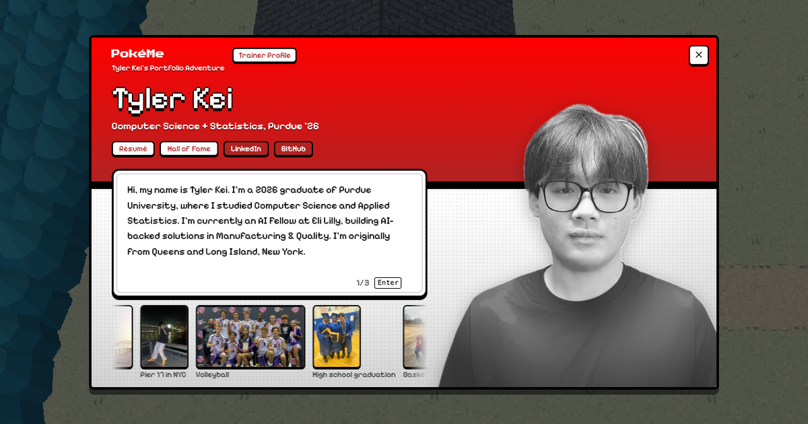

# PokéMe: Tyler Kei's Portfolio Adventure

PokéMe is my personal portfolio website, built as a small playable game in the style of
Pokémon Black & White. Instead of scrolling a page, visitors walk through places from my
life, from my hometown in New York to Purdue University, and finish in a Hall of Fame that
holds my projects, work, and milestones.

You don't have to play to get the essentials. The first screen is my **Trainer Profile**,
with buttons for my résumé, the Hall of Fame, LinkedIn, and GitHub.



---

## Contents

1. [How to play](#how-to-play)
2. [The journey](#the-journey)
3. [The Hall of Fame](#the-hall-of-fame)
4. [Changing the content](#changing-the-content)
5. [Running it on your own computer](#running-it-on-your-own-computer)
6. [Putting it online](#putting-it-online)
7. [How it's built](#how-its-built)
8. [Credits](#credits)

---

## How to play

The site is made for a computer with a keyboard (it isn't designed for phones).

| Key | What it does |
|---|---|
| **W A S D** or the arrow keys | Walk |
| **Shift** (hold) | Run |
| **Z**, **Enter**, or **Space** | Talk, read, and continue text |
| **R** | Open my résumé (PDF) |
| **P** | Reopen my Trainer Profile |
| **X** | Open the phone |
| **F** | Skip straight to the Hall of Fame |
| **Esc** | Close a window |

The same shortcuts appear as buttons in the small menu in the bottom-left corner.

## The journey

Each area is a real place that matters to me. Walking north takes you from one to the next.

| # | Area | What's there |
|---|---|---|
| 1 | **New Hyde Park** | My hometown: my house (with my bedroom upstairs), NHP Memorial, my elementary school (HGS), and the Memorial Park court |
| 2 | **Oakland Gardens** | A quiet garden path past apartment blocks |
| 3 | **Hidden Grove** | A cherry-blossom grove where the first legendary Pokémon, **Latias**, appears. Beating it unlocks the music player |
| 4 | **Main Street Flushing** | A busy Queens street of storefronts, signs, a city bus, and crosswalks |
| 5 | **The Throgs Neck Crossing** | A bridge, named for the drive to every volleyball practice |
| 6 | **American Turners** | My volleyball club. The TV in the gym plays my highlight videos |
| 7 | **Purdue University** | Campus, with the Bell Tower and Lawson, the computer science building |
| 8 | **Whirlpool Cave** | Home of the second legendary, **Lugia**. Beating it opens a portal |
| 9 | **Hall of Fame** | The end of the journey: my projects and milestones (below) |

## The Hall of Fame

Walk up the red carpet. Each exhibit opens on its own when you step right beside it.

| Exhibit | Opens |
|---|---|
| AAU Nationals podium | A photo from the 2022 AAU Nationals |
| Purdue Pete statue | My college graduation photo |
| Robotic hands at a piano | The **Piano Hand Algorithms** interactive dashboard |
| Rolls-Royce on a turntable | The **Rolls-Royce Data Synthesizer** interactive dashboard |
| Giant handheld console | "How I built this": how this website was made |
| Eli Lilly console | My work as an AI Fellow at Eli Lilly |

After you've opened both project dashboards, my contact card appears.

---

## Changing the content

Most updates only mean replacing a file or editing a line of text. You don't need to touch
the game's code.

| I want to change... | Where it lives |
|---|---|
| My résumé | Replace `public/resume.pdf` (keep the same file name) |
| My headshot | Replace `public/material/about/headshot.webp` |
| The scrolling photos in my profile, and their captions | Photos in `public/material/about/`, captions at the top of `src/ui/AboutScreen.tsx` (the `PHOTOS` list) |
| The text in my profile | The `PAGES` list near the top of `src/ui/AboutScreen.tsx` |
| The Hall of Fame cards (Eli Lilly, "How I built this") | `src/data/exhibits.ts` |
| The Hall of Fame photos | `public/material/halloffame/` |
| My email, LinkedIn, and GitHub links | The `contact` entry in `src/data/content.json` |
| The volleyball highlight videos | `public/videos/`, listed in the `highlights` entry of `src/data/content.json` |
| The project dashboards | `public/piano-hand-project/` and `public/rolls royce data synthesizer project/` |
| The link preview shown when the site is shared | Replace `public/og-preview.png` (1200 × 630 pixels) |

After editing, check your change by running the site on your computer (next section).

## Running it on your own computer

You need **Node.js** installed (the free "LTS" version from [nodejs.org](https://nodejs.org)).

1. Download this project (on GitHub: the green **Code** button, then **Download ZIP**, and unzip it).
2. Open a terminal in the project folder.
3. Install the building blocks (only needed once):
   ```
   npm install
   ```
4. Start the site:
   ```
   npm run dev
   ```
5. Open **http://localhost:5173** in your browser. Changes you save show up automatically.

To stop it, press **Ctrl + C** in the terminal.

## Putting it online

The finished website is a folder of ordinary files, so any static host works.
[Vercel](https://vercel.com) and [Netlify](https://netlify.com) are free and the easiest.

1. Sign in to Vercel (or Netlify) with GitHub and import this repository.
2. Use these settings (they're usually detected automatically):
   - **Build command:** `npm run build`
   - **Output folder:** `dist`
3. Deploy. You'll get a web address within a minute or two.
4. **One last step:** in `index.html`, change the two preview-image lines
   (`og:image` and `twitter:image`) from `/og-preview.png` to the full address, for example
   `https://your-site.vercel.app/og-preview.png`. LinkedIn and Slack need the full address to
   show the preview picture when the link is shared.

To build the final files yourself without publishing, run `npm run build`. They appear in `dist/`.

---

## How it's built

This section is for engineers.

- **Engine:** a custom 3D tile-map engine in strict-mode **TypeScript** and **Three.js** (WebGL),
  about 6,000 lines, with a `requestAnimationFrame` game loop, instanced meshes for repeated
  scenery, and billboarded 2D sprites in a 3D world.
- **Procedural art:** every building, prop, and ground texture is painted in code with the
  Canvas 2D API at runtime (25 terrain types, 50 prop types), so there are no 3D model files.
- **Data-driven maps:** each area is a typed data file (ground grid, props, warps, walk-in
  triggers). Cutscenes and interactions are `async`/`await` scripts.
- **Interface:** **React** and **Zustand** for the profile, résumé viewer, exhibit windows, and
  battle menus, styled with **Tailwind CSS** and bundled with **Vite**. The game code is about
  240 KB gzipped.

```
src/
  engine/   the game engine: rendering, movement, camera, battles, procedural props
  maps/     one file per area (layout, buildings, exits, exhibits)
  ui/       the React windows: Trainer Profile, résumé viewer, pop-ups, menu
  systems/  shared game state (Zustand)
  data/     editable text: résumé data, contacts, Hall of Fame cards
public/     files served as-is: résumé, photos, videos, dashboards, game sprites
tools/      scripts that prepared the sprite sheets and videos
assets-src/ original sprite sheets the game sprites were cut from
```

| Command | What it does |
|---|---|
| `npm run dev` | Run locally with live reload |
| `npm run build` | Type-check and build the production site into `dist/` |
| `npm run preview` | Serve the built `dist/` folder locally |

## Credits

Built by **Tyler Kei**: [LinkedIn](https://www.linkedin.com/in/tyler-kei) |
[GitHub](https://github.com/tylerkei9)

PokéMe is a personal, non-commercial fan project inspired by Pokémon Black & White.
Pokémon and its characters and sprites are trademarks and property of Nintendo, Game Freak,
and The Pokémon Company. This project is not affiliated with or endorsed by them.
