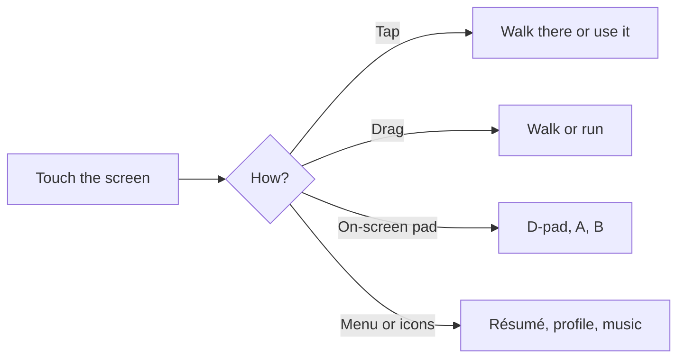

# PokéMe: Tyler Kei's Portfolio Adventure

PokéMe is my personal portfolio website, built as a small playable game in the style of
Pokémon Black & White. Instead of scrolling a page, visitors walk through places from my
life, from my hometown in New York to Purdue University, and finish in a Hall of Fame that
holds my projects, work, and milestones.

You don't have to play to get the essentials. The first screen is my **Trainer Profile**,
with buttons for my résumé, the Hall of Fame, LinkedIn, and GitHub.


---

## Contents

1. [How to play](#how-to-play) (computer and phone)
2. [The journey](#the-journey)
3. [The Hall of Fame](#the-hall-of-fame)
4. [What's new](#whats-new)
5. [Changing the content](#changing-the-content)
6. [Running it on your own computer](#running-it-on-your-own-computer)
7. [Putting it online](#putting-it-online)
8. [Common questions](#common-questions)
9. [What these words mean](#what-these-words-mean)
10. [How it's built](#how-its-built)
11. [Credits](#credits)

---

## How to play

The site works on a computer and on a phone. The game, windows, and content are the same on both.

### On a computer

| Key | What it does |
|---|---|
| **W A S D** or the arrow keys | Walk |
| **Shift** (hold) | Run |
| **Z**, **Enter**, or **Space** | Talk, read, and continue text |
| **R** | Open my résumé (PDF) |
| **P** | Reopen my Trainer Profile |
| **X** | Open the phone |
| **F** | Skip straight to the Hall of Fame |
| **Esc** | Close a window |

The same shortcuts appear as buttons in the small menu in the bottom-left corner. You can also
**click** the map to walk there, and click a person, sign, or exhibit to walk up and use it.

### On a phone

Turn the phone sideways. In portrait the game asks you to rotate (on iPhone, switch off
rotation lock). Everything can be done by touch:

```
 ┌──────────────────────────────────────────────────────────┐
 │  (menu)                                      (music)     │
 │   ≡                                            ♪         │
 │  ┌───┐                                                   │
 │  │ ▲ │          the game fills the screen       ( A )    │
 │ ◄│   │►                                      ( B )       │
 │  │ ▼ │                                                   │
 │  └───┘                                                   │
 └──────────────────────────────────────────────────────────┘
   D-pad                                          A and B
```

| Do this | To |
|---|---|
| **Tap** the ground | Walk there |
| **Tap** a person, sign, door, or exhibit | Walk up to it and use it |
| **Drag** on the map | Walk in that direction (a long drag runs) |
| **D-pad**, **A**, **B** | Walk, talk or continue, and run (hold B) |
| **Tap** the text box | Continue the text |
| **Tap** YES or NO | Answer a question |
| **Tap** a battle button | Fight (the on-screen controls hide during battles) |
| **≡ menu** | Résumé, Trainer Profile, phone, and skip to the Hall of Fame |
| **♪ icon** | Open or fold the music player |



Windows are made for a sideways screen. The résumé and project windows split into pages you
swipe through, the three dashboards open at full width and scroll up and down, and every window
has a small ✕ in the corner. The menu and the music player fold away when you touch anything else.

## The journey

Each area is a real place that matters to me. Walking north takes you from one to the next.

| # | Area | What's there |
|---|---|---|
| 1 | **New Hyde Park** | My hometown: my house (with my bedroom upstairs), NHP Memorial, my elementary school (HGS), the Memorial Park court, and Bob Howard's Candy Shop |
| 2 | **Oakland Gardens** | A quiet garden path past apartment blocks |
| 3 | **Hidden Grove** | A cherry-blossom grove where the first legendary Pokémon, **Latias**, appears. Beating it unlocks the music player |
| 4 | **Main Street Flushing** | A busy Queens street of storefronts, signs, a city bus, and crosswalks |
| 5 | **The Throgs Neck Crossing** | A bridge, named for the drive to every volleyball practice |
| 6 | **American Turners** | My volleyball club. The TV in the gym plays my highlight videos on a loop |
| 7 | **Purdue University** | Campus, with the Bell Tower and Lawson, the computer science building |
| 8 | **Whirlpool Cave** | Home of the second legendary, **Lugia**. Beating it opens a portal |
| 9 | **Hall of Fame** | The end of the journey: my projects and milestones (below) |

## The Hall of Fame

Walk up the red carpet. Each exhibit opens on its own when you step right beside it.

| Exhibit | Opens |
|---|---|
| AAU Nationals podium | A photo from the 2022 AAU Nationals |
| Purdue Pete statue | My college graduation photo |
| Robotic hands at a piano | The **Piano Hand Algorithms** interactive dashboard |
| Rolls-Royce on a turntable | The **Rolls-Royce Data Synthesizer** interactive dashboard |
| Giant handheld console | An interactive architecture diagram of how this website works |
| Eli Lilly console | A display of my AI Fellow role (nothing opens) |

---

## What's new

| Feature | Computer | Phone |
|---|---|---|
| Sideways phone layout, on-screen pad, tap and drag controls | Not needed | New |
| Click to walk and use things | New | Tap |
| Music player | Small ♪ icon that opens a compact player and folds when you click elsewhere | Same |
| Highlights TV | Clips play one after another in a loop, with no buttons | Same |
| Dashboards | Unchanged full-size window | Laid out at desktop width and scaled to fit, with tap-to-show hints and bigger tap targets |
| Windows | Small ✕ in the corner, no button backgrounds | Same, with swipe pages for the résumé and projects |
| Trainer Profile | Unchanged | Same layout as the computer, scaled down; swipe the text box to change page |
| Bob Howard's Candy Shop | Added to New Hyde Park | Same |

---

## Changing the content

Most updates only mean replacing a file or editing a line of text. You don't need to touch
the game's code.

| I want to change... | Where it lives |
|---|---|
| My résumé | Replace `public/resume.pdf` (keep the same file name) |
| My headshot | Replace `public/material/about/headshot.webp` |
| The scrolling photos in my profile, and their captions | Photos in `public/material/about/`, captions at the top of `src/ui/AboutScreen.tsx` (the `PHOTOS` list) |
| The text in my profile | The `PAGES` list near the top of `src/ui/AboutScreen.tsx` |
| The Hall of Fame photos | `public/material/halloffame/` |
| My email, LinkedIn, and GitHub links | The `contact` entry in `src/data/content.json` |
| The volleyball highlight videos | `public/videos/`, listed in the `highlights` entry of `src/data/content.json` |
| The project dashboards | `public/piano-hand-project/` and `public/rolls royce data synthesizer project/` |
| The link preview shown when the site is shared | Replace `public/og-preview.png` (1200 × 630 pixels) |

After editing, check your change by running the site on your computer (next section).

## Running it on your own computer

You need **Node.js** installed (the free "LTS" version from [nodejs.org](https://nodejs.org)).

1. Download this project (on GitHub: the green **Code** button, then **Download ZIP**, and unzip it).
2. Open a terminal in the project folder.
3. Install the building blocks (only needed once):
   ```
   npm install
   ```
4. Start the site:
   ```
   npm run dev
   ```
5. Open **http://localhost:5173** in your browser. Changes you save show up automatically.

To stop it, press **Ctrl + C** in the terminal.

## Putting it online

The finished website is a folder of ordinary files, so any static host works.
[Vercel](https://vercel.com) and [Netlify](https://netlify.com) are free and the easiest.

1. Sign in to Vercel (or Netlify) with GitHub and import this repository.
2. Use these settings (they're usually detected automatically):
   - **Build command:** `npm run build`
   - **Output folder:** `dist`
3. Deploy. You'll get a web address within a minute or two.
4. **One last step:** in `index.html`, change the two preview-image lines
   (`og:image` and `twitter:image`) from `/og-preview.png` to the full address, for example
   `https://your-site.vercel.app/og-preview.png`. LinkedIn and Slack need the full address to
   show the preview picture when the link is shared.

To build the final files yourself without publishing, run `npm run build`. They appear in `dist/`.

**After it's live, updates are automatic.** Every time a change is saved to this GitHub repository,
Vercel rebuilds and republishes the site within a couple of minutes. You never upload files by hand.

## Common questions

**How do I update my résumé on the live site?**
Replace `public/resume.pdf` with the new file (same name), then save the change to GitHub. On
github.com you can do this without any tools: open the `public` folder, choose **Add file → Upload
files**, drop in the new `resume.pdf`, and click **Commit changes**. Vercel republishes the site by itself.

**Does it work on my phone?**
Yes, in landscape. Rotate the phone and play with the on-screen pad, by tapping, or by dragging. See
[On a phone](#on-a-phone).

**Why does the music icon disappear?**
It hides while a window is open so it doesn't sit on the window's ✕. The music keeps playing.

**Something looks broken after a change. How do I undo it?**
On GitHub, every saved change is kept in the history (the **Commits** list). In Vercel, open the
project, go to **Deployments**, pick an earlier one that worked, and choose **Promote to Production**
to put it back online instantly.

**Does this cost anything?**
No. GitHub and Vercel's free plans cover a personal site like this one.

## What these words mean

| Word | Meaning |
|---|---|
| **Repository (repo)** | A project folder stored on GitHub, with the full history of every change |
| **Commit** | One saved change in that history, with a short note describing it |
| **Push** | Sending saved changes from your computer up to GitHub |
| **Terminal** | The text window where you type commands like `npm run dev` |
| **Node.js / npm** | Free tools that download this project's building blocks and run it |
| **Build** | Turning the source code into the finished files a browser loads (the `dist` folder) |
| **Deploy** | Putting the built site on the internet at a public address |
| **Vercel** | A free hosting service that builds and publishes the site straight from GitHub |
| **Link preview** | The picture and title that appear when the site's link is shared on LinkedIn or Slack |

---

## How it's built

This section is for engineers.

- **Engine:** a custom 3D tile-map engine in strict-mode **TypeScript** and **Three.js** (WebGL),
  about 6,000 lines, with a `requestAnimationFrame` game loop, instanced meshes for repeated
  scenery, and billboarded 2D sprites in a 3D world.
- **Procedural art:** every building, prop, and ground texture is painted in code with the
  Canvas 2D API at runtime (25 terrain types, 53 prop types), so there are no 3D model files.
- **Data-driven maps:** each area is a typed data file (ground grid, props, warps, walk-in
  triggers). Cutscenes and interactions are `async`/`await` scripts.
- **Phone input:** the on-screen pad sends the same key events as the keyboard, so every menu and
  battle works unchanged. Taps and drags go through `Engine.tap` and `Engine.swipe`, and the game
  stops drawing while a window covers it.
- **Interface:** **React** and **Zustand** for the profile, résumé viewer, exhibit windows, and
  battle menus, styled with **Tailwind CSS** and bundled with **Vite**. The game code is about
  240 KB gzipped.

```
src/
  engine/   the game engine: rendering, movement, camera, battles, procedural props
  maps/     one file per area (layout, buildings, exits, exhibits)
  ui/       the React windows: Trainer Profile, résumé viewer, pop-ups, menu
  systems/  shared game state (Zustand)
  data/     editable text: résumé data, contacts, Hall of Fame cards
public/     files served as-is: résumé, photos, videos, dashboards, game sprites
tools/      scripts that prepared the sprite sheets and videos
assets-src/ original sprite sheets the game sprites were cut from
```

| Command | What it does |
|---|---|
| `npm run dev` | Run locally with live reload |
| `npm run build` | Type-check and build the production site into `dist/` |
| `npm run preview` | Serve the built `dist/` folder locally |

**The architecture diagram** (opened by the handheld console in the Hall of Fame) is built with
[Archify](https://github.com/tt-a1i/archify). Its source is a typed JSON graph,
`public/architecture/pokeme-world.archify.json`. Every box cites the exact file and lines it
describes, pinned to a commit, and Archify validates the graph before compiling it into
`public/architecture/index.html`. To change it, edit the JSON and rebuild:

```
npx skills add tt-a1i/archify --skill archify --agent claude-code --copy --yes
node .claude/skills/archify/bin/archify.mjs finalize architecture public/architecture/pokeme-world.archify.json public/architecture/index.html --repo-root . --quality showcase
node tools/archify-postprocess.mjs
```

The last step keeps the page in Classic light, hides the source badges until a box is clicked, and removes Archify's theme, style, export, full-screen, path, lens ("Compare system roles"), zoom, and node-index controls; the legend is a plain key. It also adds the opening animation: the numbered main path builds box by box, each arrow drawing itself to the next box, then the remaining boxes grow outward along their arrows. When a box is clicked, its details panel places itself where it doesn't cover that box or the boxes connected to it.

## Credits

Built by **Tyler Kei**: [LinkedIn](https://www.linkedin.com/in/tyler-kei) |
[GitHub](https://github.com/tylerkei9)

PokéMe is a personal, non-commercial fan project inspired by Pokémon Black & White.
Pokémon and its characters and sprites are trademarks and property of Nintendo, Game Freak,
and The Pokémon Company. This project is not affiliated with or endorsed by them.
